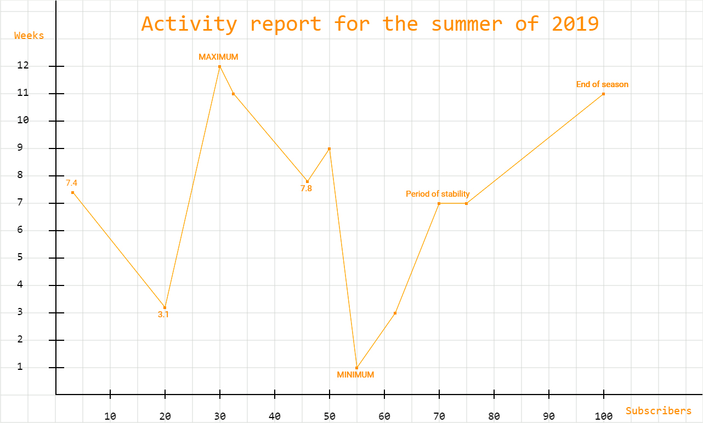

# EasyGraphJS

One more js framework.... No! This is library which help you to create graphics in JavaScript.

* **Easy to use:** EasyGraph makes it painless to create graphics of any complex. A huge set of functions allows you to perform any manipulation of graphics.
* **Primitive figures:** You can place various primitives on the chart, which allows you to make graphics more flexible and beautiful.
* **Fully cross-platform:** EasyGraphJS is a library that allows you to create graphics for browsers of any platforms and operating systems. The only requirement for the device is the ability to play HTML5 pages through a browser or other software tools and execute JavaScript code.
# Demo :


# Installation

For now, there is only one way to use:

* Add EasyGraphJS to a website as a `<script>` tag in one minute.

# Documentation
* <a href="#start">Beginning of work</a>
* <a href="#grid">Creating a grid</a>
* <a href="#axes">Creating coordinate axes:</a>
* <a href="#graphic">Creating a graphic by points</a>
* <a href="#primitives">Creating primitives</a>
    * <a href="#point">Point</a>
    * <a href="#line">Line</a>
    * <a href="#rectangle">Reactangle</a>
    * <a href="#triangle">Triangle</a>
    * <a href="#polygon">Polygon</a>
    * <a href="#circle">Circle</a>
    * <a href="#ellipse">Ellipse</a>
    * <a href="#text">Text</a>
* <a href="#color">Color system</a>
* <a href="#textMetrix">How to get TextMetrics?</a>
* <a href="#workspace">How to get information about workspace?</a>
    * <a href="#workspaceSize">Workspace size</a>
    * <a href="#offsets">Offsets</a>
    * <a href="#lineWidth">Line width</a>
* <a href="#contributing">Contributing</a>
* <a href="#license">License</a>

#### <p id="start">Beginning of work :</p>
This example will show how to add a workspace to a page. The first two parameters are width and height in pixels. The third parameter is an object that contains styles, currently only bgColor is available. The fourth parameter is the container class to which EasyGraphJS will be added. If the container class is not set, it will be added to the body tag as a child. 

```javascript
const graph =  new EasyGraphJS(1280, 770, {          
    bgColor : "white"                                
}, ".hw");
```

#### <p id="grid">Creating a grid :</p>
This example will create a grid. You can set the size of a single cell, but it can not be less than 1, the default size is 18. Also you can set width and color of grid lines.

```javascript
graph.grid({
	size : 10,     
	lineWidth : 1,     
	color : 'purple'
});
```

#### <p id="axes">Creating coordinate axes:</p>
In this example, coordinate axes will be created. You can set marks on different axes. You can also set the distance between the marks along the horizontal and vertical axes (the default value is 10). For marks, you can set the width (lineWidth) and color. You can also set text parameters (along different axes), such as font size and font family. The default text styles are 10px Arial. The last parameter `offset` is optional, but it is desirable to use it so that the axes are visible (by default, the indent is 0 and the axes are pressed to the edges of the workspace, which is why marks and labels are not visible, which is not good).

```javascript 
graph.axes({
	labels : {
		horizontal : [10,20,30,40,50,60,70,80,90,100],
	    vertical : [1,2,3,4,5,6,7,8,9,10,11,12]
	},
	distance : {
		x : 100,
		y : 50
	},
	text : {
		x : {
			fontSize : 20,
			fontFamily : "Consolas"
		},
		y : {
			fontSize : 20,
			fontFamily : "Consolas"
		}
	},
	separators : {
        lineWidth : 2,       
        color : 'black'         
    },
    offset : {
    	x : 100,
    	y : 50
    } 
});
```

#### <p id="graphic">Creating a graphic by points</p> 
This is an example in which the graph of a function is plotted by given points. The first required parameter is `points`, this is a two-dimensional array in which the first two elements are the coordinates of a point, and the third parameter is an object with two properties: the` text` string that will be placed next to this point, and the logical `top` which explains whether this text will be placed above or below the point. You can set some other point styles, such as size, font size, and text family (if installed) and point color. You can also set the width of the line that connects the two points and its color.

```javascript 
graph.drawPoints({
	points : [  
	    [totalOffset + 30, 420, {text : "74.0", top : true}],
	    [300, 210, {text : "31.0"}],
	    [400, 650, {text : "MAXIMUM", top : true}],
	    [425, 600],
	    [560, 440, {text : "78.0"}],
	    [600, 500],
	    [650, 100, {text : "MINIMUM"}],
	    [720, 200],
	    [800, 400, {text : "Period of stability", top: true}],
	    [850, 400],
	    [1100, 600, {text : "End of season", top: true}],
	],
    lineWidth : 1, 
    color : 'orange',
    pointsStyle : {
    	size : 5,
    	fontSize : 15,
    	fontFamily : "Roboto",
    	color : "darkorange"
    }
});
```

#### <p id="primitives">Creating primitives</p>
In EasyGraphJS it is very easy to create primitives. There are 8 primitives :
* <p id="point">__Point__</p>
```javascript 
graph.point({
    x : 100,      
    y : 50,
    size : 10,
    color: "blue"
});
```
* <p id="line">__Line__</p>
If you will set more than ___two___ points it will be no matter for EasyGraphJS.
```javascript 
graph.line({
    points : [
        [100, 100],
        [1280, 720]
    ],
    width : 10,
    color : "red"
});
```
* <p id="reactangle">__Rectangle__</p>
If you use stroke you can not use `bgColor` parameter.
```javascript 
graph.rectangle({
    x : 150,
    y : 20,
    width : 120,
    height : 30,
    //bgColor : "brown",
    rounded : { radius : 5 },
    stroke : {
        lineWidth : 5, 
        color : "black"
    }
});
```
* <p id="triangle">__Triangle__</p>
If you use stroke you can not use `bgColor` parameter. If you will set more than ___three___ points it will be no matter for EasyGraphJS.
```javascript 
graph.triangle({
    points : [
        [200, 200],
        [250, 200],
        [225, 250]
    ],
    //bgColor: "brown",
    stroke : {
        color : "black"
    }
});
```
* <p id="circle">__Circle__</p>
If you use stroke you can not use `bgColor` parameter. Parameters `x` and `y` are coordinates of center of the circle.
```javascript 
graph.circle({
    x : 400,
    y : 100,
    radius : 50,
    //bgColor : "violet",
    stroke : {
        color: "pink",
        lineWidth : 5
    }
});
```
* <p id="ellipse">__Ellipse__</p>
If you use stroke you can not use `bgColor` parameter. Parameters `x` and `y` are coordinates of center of the circle. Parameter `angle` must be greater than 0 and less than 1!
```javascript 
graph.ellipse({
    x : 120,
    y : 235,
    radius : {
        x : 20,
        y : 40
    },
    angle : 0.55,
    //bgColor: "red",
    stroke : {
        color : "brown",
        lineWidth : 10
    }
});
```
* <p id="polygon">__Polygon__</p>
If you use stroke you can not use `bgColor` parameter. In the `points` array, you can transfer an unlimited number of other arrays to describe the coordinates of points.
```javascript 
graph.polygon({
    points : [
        [100, 12],
        [100, 50],
        [50, 100],
        [70, 40],
        [12, 90]
    ],
    //bgColor : "brown",
    stroke : {
        color : "black",
        lineWidth : 10
    }
});
```
* <p id="text">__Text__</p>
There are many new font settings. A new `align` property may have ___start___, ___end___, ___left___, ___right___ or ___center___ values. `baseline` property may have ___top___, ___hanging___, ___middle___, ___alphabetic___, ___ideographic___, ___bottom___ values. Also you can set direction of text, like ___ltr___ or ___rtl___ . If you want to limit width of text you can do it with new `maxWidth` property.
```javascript 
graph.text({
    x : 25,
    y : 70,
    text : "Hello world!",
    font : {
        size : 20,
        family : "Consolas",
        align : "center",
        baseline : "middle", 
        direction : "ltr",
        maxWidth : 50
    },
    color : "darkorange",
    stroke : {
        lineWidth : 5, 
        color : "black"
    }
});
```

#### <p id="color">Color system :</p>
You can get string with color in three different ways : 
* Just write a string with css like value of color 
```javascript
const white = "white" || "#fff" || "rgb(255, 255, 255)" || "rgba(255, 255, 255, 1)";
```
* With static method `rgb`
```javascript
const white = EasyGraphJS.rgb(255, 255, 255); 
```
* With static method `rgba`, which can contain fourth parameter - alpha.
```javascript
const translucentBlack = EasyGraphJS.rgba(0, 0, 0, 0.5); 
```

#### <p id="textMetrix">How to get TextMetrics ?</p>
The TextMetrics interface represents the dimensions of a piece of text in the canvas. You can get it by using `getTextMetrix` method :
```javascript
const textMetrix = graph.getTextMetrix("Text");
const width = textMetrix.width; // return width of text
```
#### <p id="workspace">How to get information about workspace ?</p>
There some methods to get information about workspace :
* <p id="workspaceSize">___Workspace size___</p>
```javascript
const width = graph.getWidth();
const height = graph.getHeight();
```
* <p id="offsets">___Offsets___</p>
```javascript
const offset = graph.getOffset(); // indents from the edges of the workspace
console.log(offset.x, offset.y);
```
* <p id="lineWidth">___Line width___</p>
```javascript
const lineWidth = graph.getLineWidth(); // return width of axes lines 
```

## <p id="contributing">Contributing</p>
The main goal of this repository is to continue the development of the EasyGraphJS library, which makes it faster and easier to use. We are grateful to the community for making corrections and improvements.

## <p id="license">License</p>
EasyGraphJS is [MIT licensed](./LICENSE).
Copyright (c) 2019, David Ziarmand
